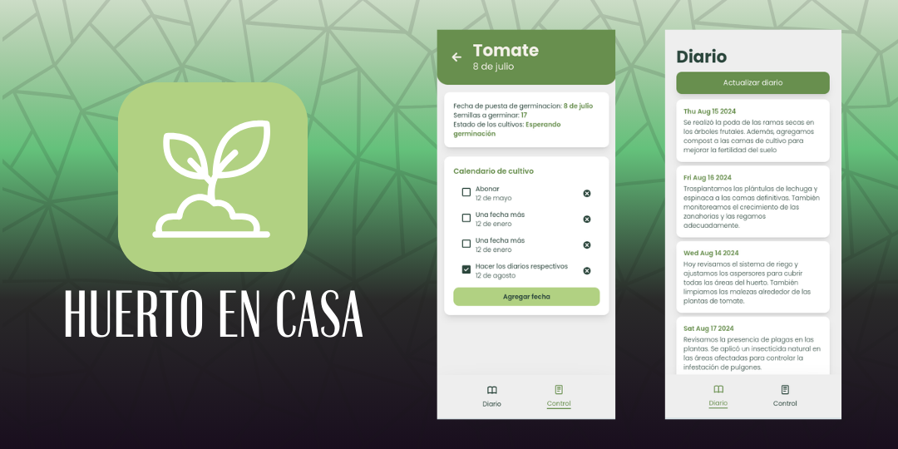
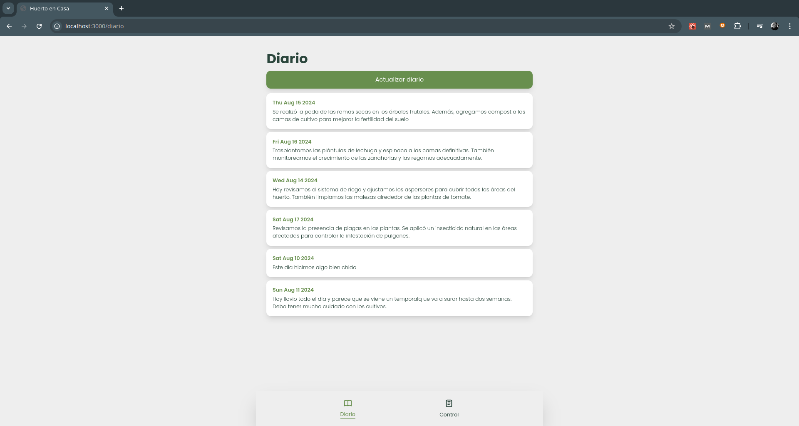

<h1 align="center">App HUERTO EN CASA</h1>

 Construido con Next.js and Supabase

## Features
En la app Huerto en Casa podemos administrar la información de nuestros cultivos. Tenemos dos principales funcionalidades por el momento.

- Diario
  - Servirá para poder guardar datos de lo que hacemos cada día en el huerto mediante
    - Un apartado para escribir notas en general
    - Un apartado para escribir observaciones en cualquier cultivo
    - Una lista de todos o pendientes del día.

- Control
  - Acá podemos llevar un control del avance de cada siembra que se hace
    - Las siembras se agrupan por cultivos, por ejemplo: tomate, cebolla, etc.
    - Las siembras se identifican por la fecha en la que se sembraron
    - Cada siembra tiene un estado según su avance, como los siguientes:
      - Esperando germinación
      - Esperando plantines
      - Trasplantados
      - y más
    - Según cada estado se puede ir actualizando el número de plantas que van avanzando en el proceso, ya que no siempre se cocechan todas las plantas que se siembran.

## Tech Stack
- Next.js
- Tailwind
- Supabase
- Yesicons

